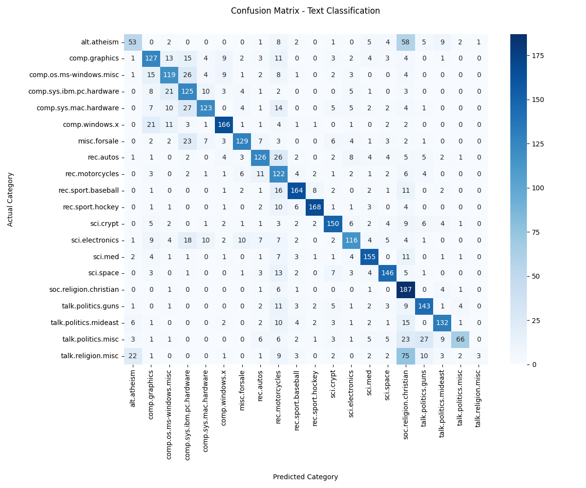

# 🧠 NLP Workshop — Text Classification on 20 Newsgroups

This project applies natural language processing techniques to build a **multi-class text classification model** using the [20 Newsgroups dataset](https://scikit-learn.org/stable/datasets/real_world.html#newsgroups-dataset). It includes text preprocessing, feature extraction with TF-IDF, model training, and evaluation.

> Built as part of the FLGF24 NLP workshop series.

---

## 📂 Project Overview

- Dataset: **20 Newsgroups** (loaded via `scikit-learn`)
- Task: Classify news articles into 20 topics
- Model: **Multinomial Naive Bayes**
- Evaluation: Accuracy, Precision, Recall, F1-Score, Confusion Matrix
- Tools: Python, scikit-learn, pandas, matplotlib, seaborn

---

## ⚙️ Workflow

1. **Data Collection**
   - Loaded via `fetch_20newsgroups()` from `sklearn.datasets`

2. **Preprocessing**
   - Lowercasing
   - Tokenization
   - Stopword removal
   - Lemmatization

3. **Feature Engineering**
   - TF-IDF Vectorization

4. **Model Training**
   - Multinomial Naive Bayes Classifier

5. **Evaluation**
   - Confusion matrix heatmap
   - Precision / recall / F1-score

---

## 🧪 Dataset Details

- 20 topics across domains like sports, religion, tech, politics, etc.
- Cleaned of headers, footers, and quotes:
```python
newsgroups = fetch_20newsgroups(subset='all', remove=('headers', 'footers', 'quotes'))
X, y = newsgroups.data, newsgroups.target
```

---

## 📁 Structure

```
assignment/
├── scripts/
│   ├── preprocess.py
│   ├── train_model.py
│   ├── evaluate.py
├── outputs/
│   ├── classification_report.csv
├── requirements.txt
├── environment.yml
├── setup.sh
├── summary.md
```

---

## 📝 Technical Reflection

This project reinforced key NLP principles — including how much preprocessing impacts performance. The Naive Bayes model performed well due to the dataset’s high-dimensional sparse nature. TF-IDF was crucial for representing meaningful text patterns, and visualizing the confusion matrix helped identify topic overlaps. To extend this project, I’d experiment with SVMs or transformer-based models like DistilBERT for deeper semantic understanding.

---

## 🖼️ Preview

  

---

## 👩‍💻 Author

Pamela Augustine  
[Portfolio](https://yourportfolio.com) • [LinkedIn](https://linkedin.com/in/pamela-augustine)
